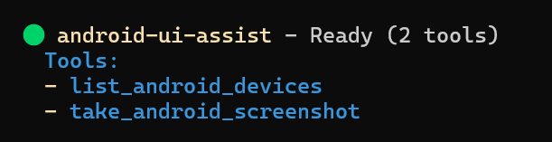

# The Android MCP

[](https://badge.fury.io/js/the-android-mcp)
[](https://opensource.org/licenses/MIT)
[](https://typescriptlang.org)
[](https://nodejs.org)

ADB-powered Model Context Protocol server that lets AI coding agents install, launch, and control Android apps, capture screenshots, and wire hot-reload ports. Built for iterative UI refinement, automated test flows, and hands-on app navigation with Expo, React Native, Flutter, and native Android projects.

Based on the original project: [infiniV/Android-Ui-MCP](https://github.com/infiniV/Android-Ui-MCP).

**Keywords:** android mcp server, adb automation, android app testing, hot reload, android ui control, ai agent android, expo, react native, flutter

## Quick Demo

See the MCP server in action with real-time Android UI analysis and control.

## Features

**Real-Time Development Workflow**

- Live screenshot capture during app development with Expo, React Native, Flutter
- Instant visual feedback for AI agents on UI changes and iterations
- Seamless integration with development servers and hot reload workflows
- Support for both physical devices and emulators during active development
- ADB-driven app install, launch, input control, and port reverse for hands-on testing

**AI Agent Integration**

- MCP protocol support for Claude Desktop, GitHub Copilot, and Gemini CLI
- Enable AI agents to see your app UI and provide contextual suggestions
- Perfect for iterative UI refinement and design feedback loops
- Visual context for AI-powered code generation and UI improvements

**Developer Experience**

- Zero-configuration setup with running development environments
- Docker deployment for team collaboration and CI/CD pipelines
- Comprehensive error handling with helpful development suggestions
- Secure stdio communication with timeout management

## Table of Contents

- [AI Agent Configuration](#ai-agent-configuration)
- [Installation](#installation)
- [GUI App (Linux)](#gui-app-linux)
- [Development Workflow](#development-workflow)
- [Prerequisites](#prerequisites)
- [Development Environment Setup](#development-environment-setup)
- [Docker Deployment](#docker-deployment)
- [Available Tools](#available-tools)
- [Usage Examples](#usage-examples)
- [Troubleshooting](#troubleshooting)
- [Development](#development)

## AI Agent Configuration

This MCP server works with AI agents that support the Model Context Protocol. Configure your preferred agent to enable real-time Android UI analysis:

### Claude Code
```bash
# CLI Installation
claude mcp add the-android-mcp -- npx the-android-mcp

# Local Development
claude mcp add the-android-mcp -- node "D:\\projects\\the-android-mcp\\dist\\index.js"
```

### Claude Desktop
Add to `%APPDATA%\Claude\claude_desktop_config.json`:
```json
{
  "mcpServers": {
    "the-android-mcp": {
      "command": "npx",
      "args": ["the-android-mcp"],
      "timeout": 10000
    }
  }
}
```

### GitHub Copilot (VS Code)
Add to `.vscode/settings.json`:
```json
{
  "github.copilot.enable": {
    "*": true
  },
  "mcp.servers": {
    "the-android-mcp": {
      "command": "npx",
      "args": ["the-android-mcp"],
      "timeout": 10000
    }
  }
}
```

### Gemini CLI
```bash
# CLI Installation
gemini mcp add the-android-mcp npx the-android-mcp

# Configuration
# Create ~/.gemini/settings.json with:
{
  "mcpServers": {
    "the-android-mcp": {
      "command": "npx",
      "args": ["the-android-mcp"]
    }
  }
}
```

### Codex
On install, the package auto-adds the server to `~/.codex/config.toml` if the file exists.
To skip auto-setup, set `THE_ANDROID_MCP_NO_CODEX_SETUP=1`.

If you need to add it manually, use:
```toml
[mcp_servers.the-android-mcp]
command = "npx"
args = ["-y", "the-android-mcp"]
timeout = 10000
```

## Installation

### Package Manager Installation

```bash
npm install -g the-android-mcp
```

### Source Installation

```bash
git clone https://github.com/meinzeug/the-android-mcp
cd the-android-mcp
npm install && npm run build
```

### Installation Verification

After installation, verify the package is available:

```bash
the-android-mcp --version
# For npm installation
npx the-android-mcp --version
```

## GUI App (Linux)

Lightweight Electron GUI that talks to the MCP server over stdio and gives you a visual control surface for devices.

```bash
# build MCP server first
npm run build

# start the GUI
cd apps/gui
npm install
npm run dev
```

**Linux sandbox note:** If Electron complains about `chrome-sandbox`, the GUI will auto-disable sandboxing. To enforce sandboxing, set `THE_ANDROID_MCP_FORCE_SANDBOX=1` and fix permissions on `apps/gui/node_modules/electron/dist/chrome-sandbox` (requires root).

The GUI auto-launches the MCP server from `dist/index.js` and exposes:
- device list + selection
- screenshots + tap overlay
- app install/start/stop
- text input + keyevents
- current activity, window size, UI hierarchy dump

## Development Workflow

This MCP server transforms how you develop Android UIs by giving AI agents real-time visual access to your running application. Here's the typical workflow:

1. **Start Your Development Environment**: Launch Expo, React Native Metro, Flutter, or Android Studio with your app running
2. **Connect the MCP Server**: Configure your AI agent (Claude, Copilot, Gemini) to use this MCP server
3. **Iterative Development**: Ask your AI agent to analyze the current UI, suggest improvements, or help implement changes
4. **Real-Time Feedback**: The AI agent takes screenshots to see the results of code changes immediately
5. **Refine and Repeat**: Continue the conversation with visual context for better UI development

**Perfect for:**

- Expo development with live preview and hot reload
- React Native development with Metro bundler
- Flutter development with hot reload
- Native Android development with instant run
- UI testing and visual regression analysis
- Collaborative design reviews with AI assistance
- Accessibility testing with visual context
- Cross-platform UI consistency checking

## Prerequisites

| Component | Version | Installation                                                                               |
| --------- | ------- | ------------------------------------------------------------------------------------------ |
| Node.js   | 18.0+   | [Download](https://nodejs.org)                                                             |
| npm       | 8.0+    | Included with Node.js                                                                      |
| ADB       | Latest  | [Android SDK Platform Tools](https://developer.android.com/studio/releases/platform-tools) |

### Android Device Setup

1. Enable Developer Options: Settings > About Phone > Tap "Build Number" 7 times
2. Enable USB Debugging: Settings > Developer Options > USB Debugging
3. Verify connection: `adb devices`


## Development Environment Setup

### Expo Development

1. Start your Expo development server:

```bash
npx expo start
# or
npm start
```

2. Open your app on a connected device or emulator
3. Ensure your device appears in `adb devices`
4. Your AI agent can now take screenshots during development

### React Native Development

1. Start Metro bundler:

```bash
npx react-native start
```

2. Run on Android:

```bash
npx react-native run-android
```

3. Enable hot reload for instant feedback with AI analysis

### Flutter Development

1. Start Flutter in debug mode:

```bash
flutter run
```

2. Use hot reload (`r`) and hot restart (`R`) while getting AI feedback
3. The AI agent can capture UI states after each change

### Native Android Development

1. Open project in Android Studio
2. Run app with instant run enabled
3. Connect device or start emulator
4. Enable AI agent integration for real-time UI analysis


## Docker Deployment

### Docker Compose

```bash
cd docker
docker-compose up --build -d
```

Configure AI platform for Docker:

```json
{
  "mcpServers": {
    "the-android-mcp": {
      "command": "docker",
      "args": ["exec", "the-android-mcp", "node", "/app/dist/index.js"],
      "timeout": 15000
    }
  }
}
```

### Manual Docker Build

```bash
docker build -t the-android-mcp .
docker run -it --rm --privileged -v /dev/bus/usb:/dev/bus/usb the-android-mcp
```

## Available Tools



| Tool                      | Description                               | Parameters                                                                 |
| ------------------------- | ----------------------------------------- | -------------------------------------------------------------------------- |
| `take_android_screenshot` | Captures device screenshot                | `deviceId` (optional)                                                      |
| `list_android_devices`    | Lists connected devices                   | None                                                                       |
| `find_android_apk`        | Finds the most recent APK in a project    | `projectRoot` (optional)                                                   |
| `install_android_apk`     | Installs an APK on a device               | `apkPath`/`apkUrl` (optional), `deviceId` (optional), install flags, `timeoutMs` |
| `uninstall_android_app`   | Uninstalls an app by package name         | `packageName`, `deviceId` (optional), `keepData` (optional)                |
| `start_android_app`       | Starts an app (optionally activity)       | `packageName`, `activity` (optional), `deviceId` (optional)                |
| `get_android_current_activity` | Gets the focused activity           | `deviceId` (optional)                                                      |
| `get_android_window_size` | Gets device window size                   | `deviceId` (optional)                                                      |
| `dump_android_ui_hierarchy` | Dumps UI hierarchy XML                  | `deviceId` (optional), `maxChars` (optional)                               |
| `stop_android_app`        | Force-stops an app                        | `packageName`, `deviceId` (optional)                                       |
| `clear_android_app_data`  | Clears app data                           | `packageName`, `deviceId` (optional)                                       |
| `tap_android_screen`      | Sends a tap event                         | `x`, `y`, `deviceId` (optional)                                            |
| `swipe_android_screen`    | Sends a swipe gesture                     | `startX`, `startY`, `endX`, `endY`, `durationMs` (optional), `deviceId`    |
| `input_android_text`      | Types text into focused input             | `text`, `deviceId` (optional)                                              |
| `send_android_keyevent`   | Sends an Android keyevent                 | `keyCode`, `deviceId` (optional)                                           |
| `reverse_android_port`    | Reverse TCP port (device → host)          | `devicePort`, `hostPort` (optional), `deviceId` (optional)                 |
| `forward_android_port`    | Forward TCP port (host → device)          | `devicePort`, `hostPort`, `deviceId` (optional)                            |
| `get_android_logcat`      | Fetch recent logcat output                | `lines` (optional), filters, `deviceId` (optional)                         |
| `list_android_activities` | List activities for a package             | `packageName`, `deviceId` (optional)                                       |
| `hot_reload_android_app`  | Reverse ports + install/start for hot dev | `packageName`, `reversePorts`, install/start options, `deviceId` (optional)|

### Tool Schemas

**take_android_screenshot**

```json
{
  "name": "take_android_screenshot",
  "description": "Capture a screenshot from an Android device or emulator",
  "inputSchema": {
    "type": "object",
    "properties": {
      "deviceId": {
        "type": "string",
        "description": "Optional device ID. If not provided, uses the first available device"
      }
    }
  }
}
```

**list_android_devices**

```json
{
  "name": "list_android_devices",
  "description": "List all connected Android devices and emulators with detailed information",
  "inputSchema": {
    "type": "object",
    "properties": {}
  }
}
```

**find_android_apk**

```json
{
  "name": "find_android_apk",
  "description": "Find the most recent APK in a project directory",
  "inputSchema": {
    "type": "object",
    "properties": {
      "projectRoot": {
        "type": "string",
        "description": "Optional project root to search for APKs"
      }
    }
  }
}
```

**install_android_apk**

```json
{
  "name": "install_android_apk",
  "description": "Install an APK on a connected Android device or emulator",
  "inputSchema": {
    "type": "object",
    "properties": {
      "apkPath": {
        "type": "string",
        "description": "Path to APK (optional; auto-detects if omitted)"
      },
      "apkUrl": {
        "type": "string",
        "description": "Optional URL to download an APK before installing"
      },
      "deviceId": {
        "type": "string",
        "description": "Optional device ID"
      },
      "reinstall": {
        "type": "boolean",
        "description": "Reinstall if already installed (-r)"
      },
      "grantPermissions": {
        "type": "boolean",
        "description": "Grant runtime permissions at install time (-g)"
      }
    }
  }
}
```

**start_android_app**

```json
{
  "name": "start_android_app",
  "description": "Start an Android app by package name",
  "inputSchema": {
    "type": "object",
    "properties": {
      "packageName": {
        "type": "string",
        "description": "Android application package name"
      },
      "activity": {
        "type": "string",
        "description": "Optional activity to launch"
      },
      "deviceId": {
        "type": "string",
        "description": "Optional device ID"
      }
    }
  }
}
```

**get_android_current_activity**

```json
{
  "name": "get_android_current_activity",
  "description": "Get the currently focused app activity",
  "inputSchema": {
    "type": "object",
    "properties": {
      "deviceId": {
        "type": "string",
        "description": "Optional device ID"
      }
    }
  }
}
```

**get_android_window_size**

```json
{
  "name": "get_android_window_size",
  "description": "Get device window size (physical/override)",
  "inputSchema": {
    "type": "object",
    "properties": {
      "deviceId": {
        "type": "string",
        "description": "Optional device ID"
      }
    }
  }
}
```

**dump_android_ui_hierarchy**

```json
{
  "name": "dump_android_ui_hierarchy",
  "description": "Dump UI hierarchy XML from the device",
  "inputSchema": {
    "type": "object",
    "properties": {
      "deviceId": {
        "type": "string",
        "description": "Optional device ID"
      },
      "maxChars": {
        "type": "number",
        "description": "Optional maximum number of characters to return"
      }
    }
  }
}
```

**tap_android_screen**

```json
{
  "name": "tap_android_screen",
  "description": "Send a tap event to the device screen",
  "inputSchema": {
    "type": "object",
    "properties": {
      "x": {
        "type": "number",
        "description": "Tap X coordinate in pixels"
      },
      "y": {
        "type": "number",
        "description": "Tap Y coordinate in pixels"
      },
      "deviceId": {
        "type": "string",
        "description": "Optional device ID"
      }
    }
  }
}
```

**reverse_android_port**

```json
{
  "name": "reverse_android_port",
  "description": "Reverse TCP port from device to host (useful for hot reload)",
  "inputSchema": {
    "type": "object",
    "properties": {
      "devicePort": {
        "type": "number",
        "description": "Device port to reverse"
      },
      "hostPort": {
        "type": "number",
        "description": "Host port to map to (defaults to devicePort)"
      },
      "deviceId": {
        "type": "string",
        "description": "Optional device ID"
      }
    }
  }
}
```

**get_android_logcat**

```json
{
  "name": "get_android_logcat",
  "description": "Fetch recent logcat output (optionally filtered)",
  "inputSchema": {
    "type": "object",
    "properties": {
      "lines": {
        "type": "number",
        "description": "Number of log lines to return"
      },
      "tag": {
        "type": "string",
        "description": "Optional log tag filter"
      },
      "priority": {
        "type": "string",
        "description": "Minimum priority (V/D/I/W/E/F/S)"
      },
      "packageName": {
        "type": "string",
        "description": "Optional package name to filter by running PID"
      },
      "deviceId": {
        "type": "string",
        "description": "Optional device ID"
      }
    }
  }
}
```

**list_android_activities**

```json
{
  "name": "list_android_activities",
  "description": "List activities for a package name",
  "inputSchema": {
    "type": "object",
    "properties": {
      "packageName": {
        "type": "string",
        "description": "Android application package name"
      },
      "deviceId": {
        "type": "string",
        "description": "Optional device ID"
      }
    }
  }
}
```

**hot_reload_android_app**

```json
{
  "name": "hot_reload_android_app",
  "description": "Reverse ports, install (optional), and start an app for hot reload",
  "inputSchema": {
    "type": "object",
    "properties": {
      "packageName": {
        "type": "string",
        "description": "Android application package name"
      },
      "reversePorts": {
        "type": "array",
        "description": "Ports to reverse (defaults to 8081)"
      },
      "install": {
        "type": "boolean",
        "description": "Whether to install an APK before starting"
      },
      "start": {
        "type": "boolean",
        "description": "Whether to start the app after setup"
      },
      "deviceId": {
        "type": "string",
        "description": "Optional device ID"
      }
    }
  }
}
```

## Usage Examples

_Example: AI agent listing devices, capturing screenshots, and providing detailed UI analysis in real-time_

### Real-Time UI Development

With your development environment running (Expo, React Native, Flutter, etc.), interact with your AI agent:

**Initial Analysis:**

- "Take a screenshot of my current app UI and analyze the layout"
- "Show me the current state of my login screen and suggest improvements"
- "Capture the app and check for accessibility issues"

**Iterative Development:**

- "I just changed the button color, take another screenshot and compare"
- "Help me adjust the spacing - take a screenshot after each change"
- "Take a screenshot and tell me if the new navigation looks good"

**Cross-Platform Testing:**

- "Capture screenshots from both my phone and tablet emulator"
- "Show me how the UI looks on device emulator-5554 vs my physical device"

**Development Debugging:**

- "List all connected devices and their status"
- "Take a screenshot from the specific emulator running my debug build"
- "Capture the current error state and help me fix the UI issue"

**App Installation & Interaction:**

- "Find the latest APK in this repo and install it"
- "Start com.example.app and open the main activity"
- "Tap the login button at (540, 1620) and type my test credentials"
- "Reverse port 8081 for hot reload, then relaunch the app"
- "Get the last 200 logcat lines for com.example.app"

## Troubleshooting

### ADB Issues

- **ADB not found**: Verify ADB is installed and in PATH
- **No devices**: Check USB connection and debugging authorization
- **Device unauthorized**: Disconnect/reconnect USB, check device authorization prompt
- **Screenshot failed**: Ensure device is unlocked and properly connected

### Connection Issues

- Verify `adb devices` shows your device as "device" status
- Restart ADB server: `adb kill-server && adb start-server`
- Check USB debugging permissions on device

## Development

### Build Commands

```bash
npm run build     # Production build
npm test          # Run tests
npm run lint      # Code linting
npm run format    # Code formatting
```

### Project Structure

```
src/
├── server.ts         # MCP server implementation
├── types.ts          # Type definitions
├── utils/
│   ├── adb.ts        # ADB command utilities
│   ├── screenshot.ts # Screenshot processing
│   └── error.ts      # Error handling
└── index.ts          # Entry point
```

## Performance

- 5-second timeout on ADB operations
- In-memory screenshot processing
- Stdio communication for security
- Minimal privilege execution

## License

MIT License - see LICENSE file for details.
